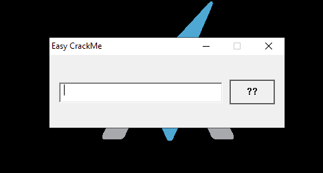
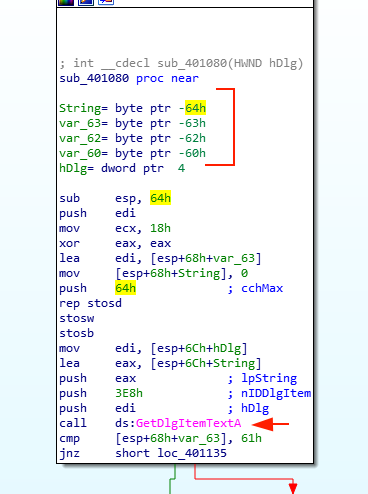
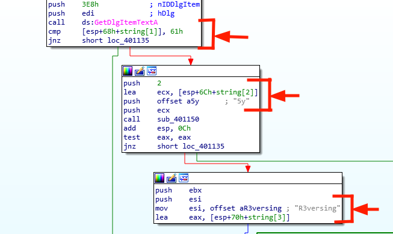
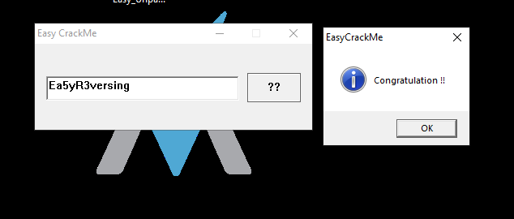

# Easy Crackme

## Overview

Hola Amigos!!

Today I am trying the first crackme from _****_ [_**reversing.kr**_](http://reversing.kr/challenge.php) _****_ marked as _100_ points. It's a simple window crackme that uses some string comparisons to check and validate the input string.&#x20;

Here is my little attempt to solve the first challenge.&#x20;

I will be just using IDA freeware coz I am too broke to use IDA Pro. So, IDA Free all the way !!!!

## Walkthrough

So, First thing first. I am going to run this executable to check its functionality.

On executing, it gives us an dialog box which contains an input field to enter a string.&#x20;

Let's input some gibberish string to check.&#x20;

So, It seems like a password checker. Alright, now we know we have to enter a password, And if the password is wrong, it will give us a pop-up "_**Incorrect Password**_".

So, let's open this binary in IDA Freeware. We already know the executable create dialog box. So, I am going to trace the call for the **DialogBoxParam**(WIN32 API to Creates a modal dialog box) in IDA.

### Inspecting the file with IDA

On opening the file in IDA. We can see the call to the **DialogBoxParam** with the field **lpDialogFunc** having the function name **DialogFunc**. This function seems like it can help us and might be responsible for the input validation.

### Inspecting DialogFunc

.png>)

On opening the DialogFunc in the graph, we can see a branch ** **_**`loc40105E`** _ calling t_he **En**_**dDialog** API which will invoke when the Dialog box closes. So, we dont wanna go there.&#x20;

The other branch _**`loc4041049`**  could be our main functionality as it makes a call to another function **`sub_401080`**_ which seems interesting as it pushes _**Dlg**_(handle of the dialog box) just before it.&#x20;

### Inspecting function sub\_401080

On inspecting the function _**`sub_401080`** we see a call to **GetDlgItemText** _ which implies that it takes the input from the dialog box and put it into a string. And if we will just look at the stack variable on top, we have four variables _**`string`**_, _**`var_63`**, **`var_62` **_ and _**`var_60`**_.

These variables are kind of too close to each other with respect to their offset. So, it seems like the variable _**`string`**_ is the first part of the password, _**`var_63`**_ is one byte down from _**`string`**_. So, _**`var_63`**_ must be _**`string[1]`**_  and same with _**`var_62`**_ and _**`var_60`**_. So, we can conclude :

`var_ 63 = string[1]`&#x20;

`var62 = string[2]`

`var60 = string[3]`

&#x20;So, we can assume that our password is the concatenation of 4 variables.

> #### `password  = string + string[1] + string[2] + string[3]`

I am going to rename these variables in IDA for ease and we will move ahead.

So, Just after the call to _**GetDlgItemText**_, we see a comparison of the byte stored in _**`string[1]`**_ with **61h**(ASCII Value = '**a**'), If the check succeeds we move further in our code else it gives us a pop-up "_**Incorrect Password**_". Now we have our initial finding that our second variable contains '**a**'.

Moving on to the  next branch we see, our _**`string[2]`**_ is pushed as parameter followed by a string "_**5y**_", and then it calls to function _**`sub_401150`**_, which basically checks if our _**`string[2]`**_ is equal to "_**5y**_" or not.

Hence, we got the value of our third variable which is "_**5y"**_.&#x20;

So, far we have:

> _**`password  = *a5y*`** (\* = wildcard)_

In the next branch, we see a string "_**R3versing**_" is passed into _**`esi`**_ and our _**`string[4]`**_ is passed into _**`eax,`**_ which further goes into string comparison loop which checks each character of _**`string[4]`**_ matches with "_**R3versing**_" or not. Hence, we got the last part of our password too. Now, we are left with the first part.

> _**`password  = *a5yR3versing`**_ (\* = wildcard)

Lets move forward,

Finally, we are checking the first character ot string with _**`45h`**_(ASCII = '_**E**_'). If they are not equal we get a pop-up of "_**Incorrect Password**_", else we get the "_**Congratulation !!**_" message.

### Flag

Well well well! Look how far we have come. Its time to summarize all of our effort and submit our password.

> _**`password = Ea5yR3versing`**_

And, Voila!! Sweet Victory message. Give a pat to yourself for reaching the end. :clap:

Adios, Keep solving more crackmes!!!
