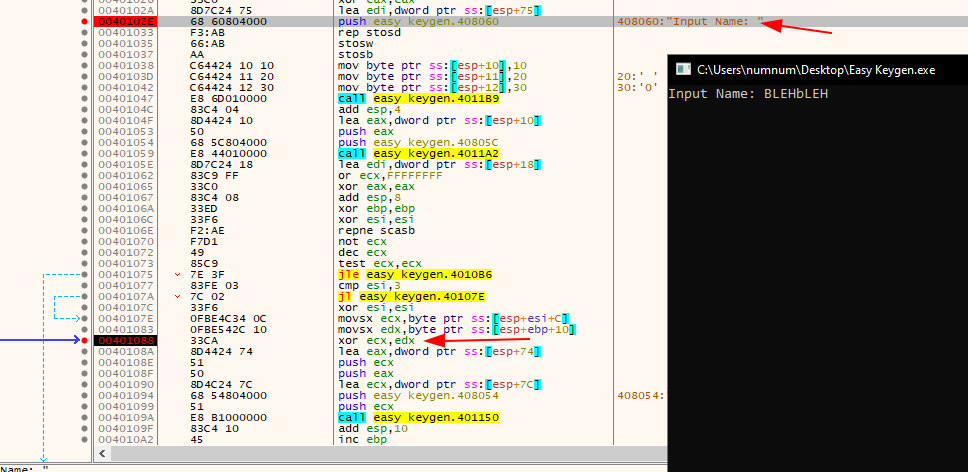

# Easy Keygen

## Overview

Hello all!

This is a follow up post for the next challenge from reversing.kr marked as 100 points.

Its a window crackme.&#x20;

On downloading  the zip file we are provided with two files this time. One is our regular executable, `Easy Keygen.exe` and second is a `ReadMe.txt` .

Task for this crackme is to find the name for  given Seria No.&#x20;

## Walkthrough

Same as we did last time, I am going to run this executable to check out its functionality.

&#x20;THe exe give us a prompt  and ask for an input of name and Serial number. We already have our Serial no. We just gotta figure out the name corresponding to this Serial.&#x20;

Lets  check this all out in our IDA.

### Inspecting file with IDA

On Inspecting it in IDA. it shows us the graph from the entry point. Its not our main method which we are looking for.  We have to find our main to analyze it.

When we executed our file, it gave us string Input Name. SO i am going to search that string in IDA and trace the function. Just go to Search->text  enter your string and it will show the data section where string reside and in which function it is used.&#x20;

On searching for our string, we can see its  used in sub\_401000. Clicking on it, we got to our main function.

.png>)

Analysing our main function sub_401000. We see our string "Input Name" getting pushed on stack as parameter, and then thier is a call to sub_4011B9 fucntion. which persuambly work as printf funtion, printing our string on command line window.

Moving on we see call to sub_4011A2 function with two parameter pushed. One is var\_12c variable and second is string "%s". This is more likely to be a scanf call. which uses "%s" as format specifier for string, and var\_12C is our variable which will contain input string. I am going to rename var\_!2c as name\_var for ease._&#x20;

_Further we see our input get loaded into edi, and then there is  a block of assembly code. We gonna break it down. Bear with me, It wont be much hard._&#x20;

_After out input of name\_var get loaded into edi, ecx have 0FFFFFFFh and eax , ebp and esi become zero. Then there is call repne scasb. A quick google give us:_

> [REPNE](https://faydoc.tripod.com/cpu/repne.htm) (repeat while not equal)
>
> SCASB (byte comparison); ES:(E)DI is assumed to be the memory operand and AL, AX, or EAX is assumed to be the register operand.

_So, SCASB will search for byte EAX hold(which is zero in our case) inside the memory holded by edi(which now  contain our name\_var) and REPNE, will repeat until this condition is not equal._

_In SImpler term, this call will check for end of our string and go on until we will reach the end of our  name\_var which will be terminated by null terminator. Meanwhile ecx will decrreament aftr every comparison._&#x20;

_And after the not ecx and dec ecx, our ecx will end up contining the length of name\_var._&#x20;

_test ecx ecx will check of our string is zero or not. In our case its not. So, lets move further to non zero side._&#x20;

_On top esi is being comapred to 3. If its 3, itsget XORed by itself, which will make esi zero. Then it goes to next block and the again come back and compare it with 3. Therefore, during loop our esi will range in between 0 to 2._&#x20;

_In our big block of  code, we move var\_130 to ecx._&#x20;

_If we look at the starting of our main fucntion, we cna see the var\_130 getting populated with some values._&#x20;

_Afterwards, our name\_var is moved into edx. Now edx and ecx is  getting xored. The result is then pushed into stack as parameter. Then theres call to a fucntion sub\_401150._

&#x20;_I tried checking out this fucntion. BUt it contain more functin call inside. So, its better to see the working of this function dynamically._

_I am going to open the executable in x32 dbg._

I searched for the string "Input Name" to set our first breakpoint. Then I traced for our XOR fucntion and set one breakpoint there. Now after running it, It ask for input I provided "BLEHbLEH" and after it hit our second breakpoint of XOR.&#x20;

If we llok into our register, the ECX contain the first value of var\_130 i.e 10 and the EDX contain first byte of our input string, i.e B.ck in&#x20;

After doing the XOR operation of ascii 'B' and 0x10, the result is  hexadecimal 52, which stored back in avr\_c8 as string "52". Same for second iteration:

 

Its stores the second charater 'L' into stack and then XOR it with hexadecimal 20 and concatenate the result as string in var\_C8.

This loop will go on till the end of the string.&#x20;

Let go back to our IDA, to  analyse the rest of code.&#x20;

This block is same as we seen before, Its prints the "Input Serial" on command line and make a scanf call for user input. And the inckled in put is stored into our variable name\_var.

After this, the var_c8(contain XORed input name) is loaded into esi and name_\_var is loaded into eax.

In further code we see the same block of code as we seen in our previous writeup Easy Crackme, which will comapred our name_var(contain serial number) with var_c8, if they match or not. Then we get the success message.&#x20;

So, we have to find the name,&#x20;
