# Easy Keygen

## Overview

Hello all! :smile:

This is a follow-up post for the next challenge from [_**reversing.kr**_](http://reversing.kr/challenge.php) marked as 100 points.

This challenge basically consists of analyzing the operation getting performed on user input and then writing a script to reverse those operations in order to find our flag.&#x20;

On downloading the zip file we are provided with two files this time. One is our regular executable, `Easy Keygen.exe` and second is a `ReadMe.txt` .

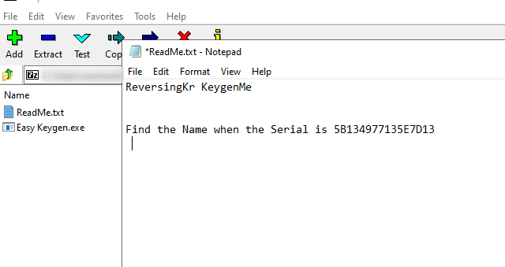

The Task for this crackme is to find the name for the given Serial.&#x20;

## Walkthrough

Same as we did last time. First, I am going to run this executable to check out its functionality.

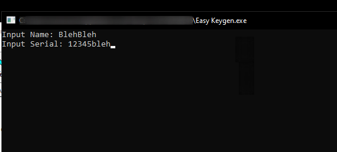

&#x20;THe exe gives us a prompt and asks for input of name and Serial. We already have our Serial. We just gotta figure out the name corresponding to this Serial.&#x20;

Let's check this all out in our IDA.

### Inspecting file with IDA

On Inspecting it in IDA. it shows us the graph from the entry point. It's not the main method which we are looking for.  We have to find our main function to analyze it.

When we executed our file, it gave us the string **`"Input Name"`**. So, I am going to search the same string in IDA to trace the main function. Just go to `Search->text`  enter your string and it will show the data section where the string resides and in which function it is used.&#x20;


#### Inspecting function sub\_401000

On searching the string, we can see it used in the function **`sub_401000`**. On looking at this function, it looks like our main function.&#x20;

.png>)

Analyzing our main function **`sub`**_**`401000`**._ We see our string _"**`Input Name`**"_ getting pushed onto the stack as a parameter, and then there is a call t_o **`sub`**_**`4011B9`** function. which probably works as printf function, printing our string on the command prompt. You can make sure by running it in any debugger.&#x20;

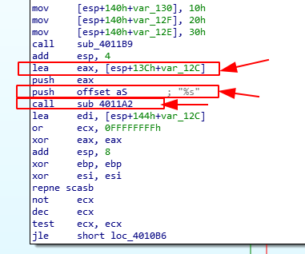

Moving on we see a call to **`sub`**_**`4011A2`**_ function and two parameter pushed before it. One is _**`var_12C`**_ variable and the second is a string _**`"%s"`**._ This is more likely to be a scanf call. which uses _"**`%s"`**_ as format specifier for string, and _**`var_12C`**_ is our variable which will contain input string. I am going to rename **`var_12C`** as **`name_var`** for ease.&#x20;

Further, we see our input gets loaded into `edi`, and then there is a block of assembly code. We gonna break down this block. Bear with me, It won't be much hard.&#x20;

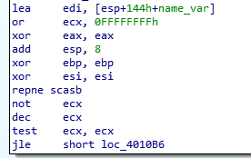

After our input of **`name_var`** get loaded into `edi`, `ecx` have 0FFFFFFFFh.&#x20;

`eax` , `ebp` and `esi` become zero, due to XOR operation with itself. Then there is a call **`repne scasb`**. A quick google search gives _us:_

> [_<mark style="background-color:yellow;">**REPNE**</mark>_](https://faydoc.tripod.com/cpu/repne.htm) _<mark style="background-color:yellow;">**(repeat while not equal)**</mark>_
>
> _<mark style="color:blue;background-color:yellow;">**SCASB**</mark>** **<mark style="background-color:yellow;">**(byte comparison); ES:(E)DI is assumed to be the memory operand and AL, AX, or EAX is assumed to be the register operand.**</mark>_

So, SCASB will search for byte `eax` hold_(which has become zero already)_ inside the memory held by `edi`_(which contains our name\_var)._ While REPNE will repeat all this until this condition is not equal.

In simpler terms, this call will check for the end of our string and go on until it will reach the end of our string **`name_var`** which will be terminated by the null terminator. Meanwhile, `ecx` will decrement after every comparison.&#x20;

And after the operation:

> <mark style="background-color:yellow;">**not ecx**</mark>
>
> <mark style="background-color:yellow;">**dec ecx**</mark>

our `ecx` will end up containing the length of the string **`name_var`**.&#x20;

> <mark style="background-color:yellow;">**test ecx, ecx**</mark>&#x20;

It will check if our `ecx` is zero or not, which means our string length. In our case, it's not. So, let's move further to the non-zero side.&#x20;

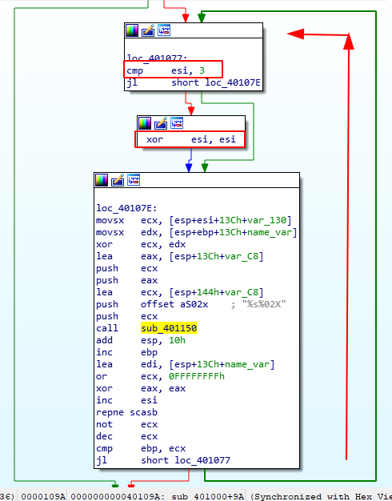

Next, we see `esi` is being compared to 3. If it's 3, it gets XORed by itself, which will make `esi` zero. Then it goes to the next block does some stuff and then again comes back and compare it with 3. Therefore, during the oop, our `esi` will range between 0 to 2.&#x20;

Coming to our block which does some stuff, it moves **`var_130`** to `ecx`.&#x20;

If we look at the starting of our main function, we can see the **`var_130`** getting populated with some values.&#x20;


Afterward, our **`name_var`** is moved into `edx`. Now `edx` and `ecx` is getting XORed. The result is then pushed into the stack as a parameter. Then there's a call to a function _**`sub_401150`**_.

I tried checking out this function. But it contains more function calls inside and it gonna take a lot of time. So, it's better to see the working of this function dynamically.

I am going to open the executable in x32dbg.

### Inspecting file with x32dbg

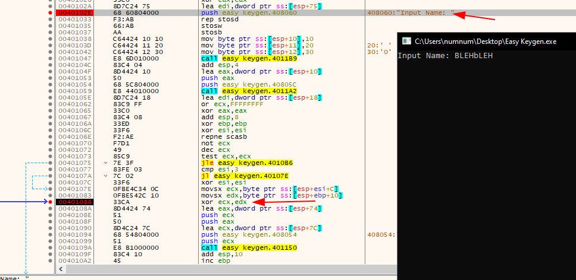

I searched for the string **`"Input Name"`** to set our first breakpoint. Then I traced for our XOR function and set one breakpoint there. Now after running it, It asks for input I provided "**BLEHbLEH**" and after it hit our second breakpoint of XOR.&#x20;

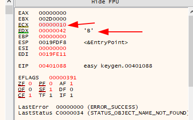

If we look into our register, the **`ecx`** contain the first value of **`var_130`** i.e `0x10` and the `edx` contain the first byte of our input string, i.e **'B'**.

After doing the XOR operation of ascii **`'B'`** and `0x10,` the result is hexadecimal `52`, which is stored back in `var_C8` as string `"52"`. Same for the second iteration:

<div align="center">

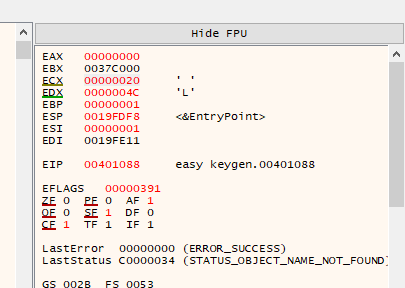

 

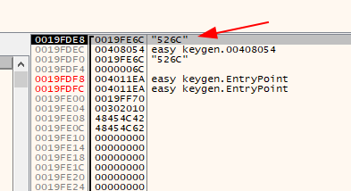

</div>

It stores the second character 'L' into `edx` and then XOR it with hexadecimal `0x20` and concatenates the result '6C' as a string in `var_C8`. Now the value is "526C" as seen above.

This loop will go on till the end of the string.

Let's go back to our IDA, to analyze the rest of the code.&#x20;

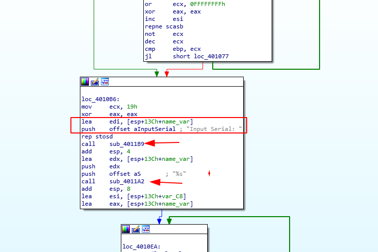

This block is the same as we saw above for input name, Its prints the **`"Input Serial`**" on the command line and makes a scanf call for user input. And the input is stored in our variable **`name_var`**.

After this, the **`var_C8`**(contain XORed input name) is loaded into `esi` and **`name_var`** is loaded into `eax`.

In further code, we see the same block of code as we have seen in our previous writeup [Easy Crackme](easy-crackme.md), these blocks will compare our **`name_var`**(contain serial number) with **`var_C8`**, if they match, then we get the success message.&#x20;

### Writing a keygen

So, we have to find the name, which on being XORed will give the serial key provided in ReadMe.txt. For doing so, I am going to reverse the XOR algorithm used above.


```python
serial = "5B134977135E7D13"

dec_serial = []
i = 0
while i < len(serial) - 1:
    dec_serial.append(int('0x' + serial[i:i + 2], 16))
    i += 2

print(dec_serial)


key = [0x10,0x20, 0x30]
c = 0
name = ''
for  i in dec_serial:
    name +=chr(i^key[c])
    if(c == 2):
        c = c^c
    else:
        c +=1

print(name)

```


In the first part, I am converting the serial into a decimal value, and then in the second, the XOR operation is getting performed with var\_c8 and the key.

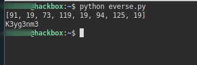

### Flag

Running the script, give us the correct name for our serial which is _**`K3yg3nm3`**_. Giving the same input in executable rewards us with a **`"Success"`** message.&#x20;

&#x20;And that's how we are done with our second challenge.&#x20;

Thanks for reading it till the end. Happy Reversing! :clap:
