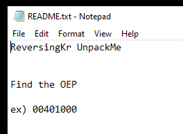

# Easy Unpack

## Overview

This is the third writeup of my reversing series from Reversing.kr. This challenge was actually easy as compared to the past two. I have shown two approaches to solve this challenge.

This time zip file contains one executable and one README.txt.

We are supposed to find OEP(Original Entry Point) in the executable.


The Original Entry Point is a concept typically referred to in reverse engineering for an executable that has been modified by some means such as being compressed (or encrypted) by a packer or infected with malware. Prior to modification, the entry-point of an executable IS the original entry point (OEP).&#x20;

When an executable has been modified, such as to include a stub of code that runs prior to the original code, the entry-point of the executable is changed to point to the new code. The stub then references the old entry-point when it is done. So once the stub runs, it will transfer control to the address of the original entry point so the modified program still works (or appears) to work as normal.


## Approach 1

[Peid](https://www.aldeid.com/wiki/PEiD) is a great tool for detecting common packers, cryptors, and compilers for PE files. It has various plugins available. One of which is Generic OEP Finder.&#x20;

On clicking the Generic OEP Finder. We get our OEP.&#x20;

## Approach 2

Drop it into x32dbg and track the process step by step. You will get a jump on `0x0040A1FB.` Follow it and you will get the OEP 00401150.

